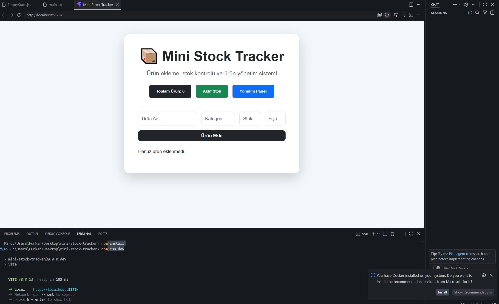
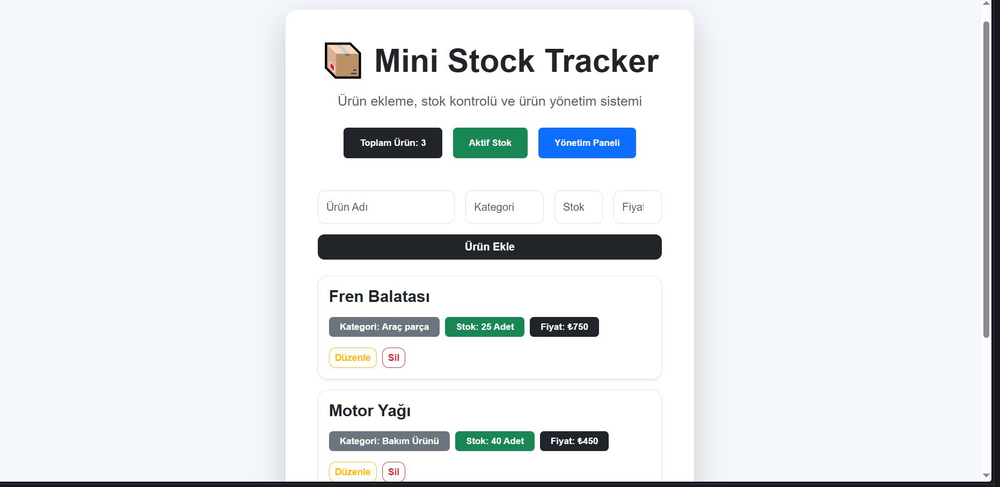
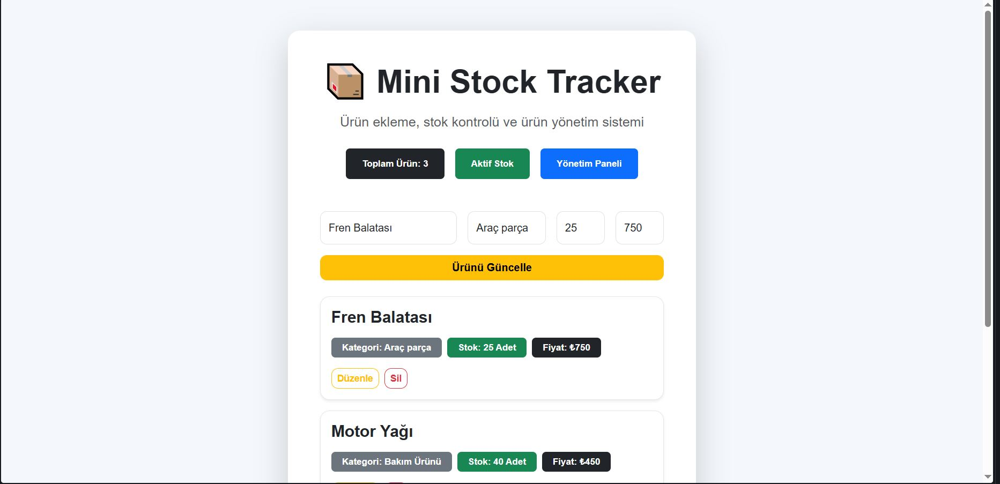

# 📦 Mini Stock Tracker

React tabanlı geliştirilmiş modern ve sade bir stok yönetim uygulamasıdır.  
Kullanıcılar ürün ekleyebilir, mevcut ürünleri görüntüleyebilir, düzenleyebilir ve sistemden kaldırabilir.

---

## 🔍 Uygulama Özellikleri

* 📥 Yeni ürün kaydı oluşturma
* 🗂️ Ürünleri listeleme
* 🛠️ Ürün bilgilerini güncelleme
* ❌ Ürün silme işlemi
* 💽 LocalStorage ile verileri tarayıcıda saklama
* 📱 Responsive kullanıcı arayüzü
* ⚡ Dinamik form kontrolü ve doğrulama işlemleri

---

## ⚒️ Kullanılan Teknolojiler

* React
* Vite
* Bootstrap 5
* JavaScript (ES6+)
* LocalStorage API

---

## 🖥️ Kurulum Adımları

Projeyi klonlayın:

```bash
git clone https://github.com/Furk4nn/mini-stock-tracker.git
cd mini-stock-tracker
```

Gerekli paketleri yükleyin:

```bash
npm install
```

Projeyi çalıştırın:

```bash
npm run dev
```

---

## 📸 Uygulama Görselleri

<p align="center">
    
    
    
</p>

---

## 🌍 Canlı Yayın

Netlify Deploy Linki:
[mini-stock-tracker.netlify.app](https://mini-stock-tracker.netlify.app)
---

## 🧩 Proje Yapısı

Bu proje geliştirilirken aşağıdaki modern frontend yaklaşımları kullanılmıştır:

* Component bazlı mimari yapı
* Custom Hook kullanımı
* Yeniden kullanılabilir React bileşenleri
* Modüler klasör organizasyonu
* Kullanıcı dostu responsive tasarım

---